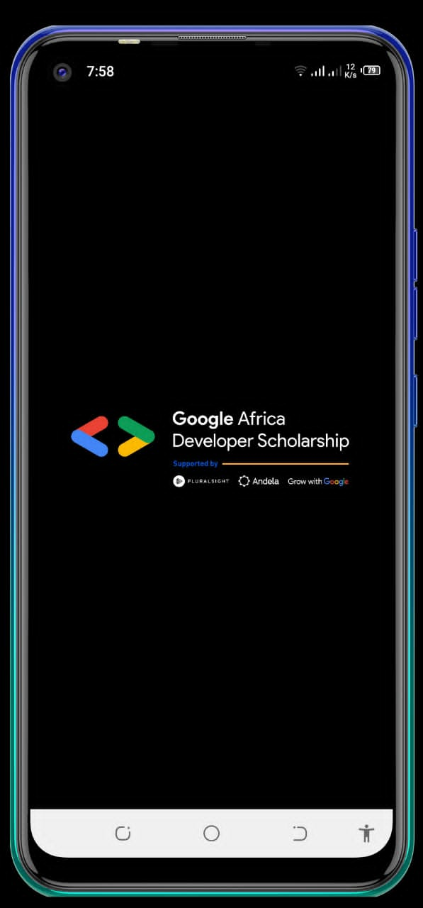
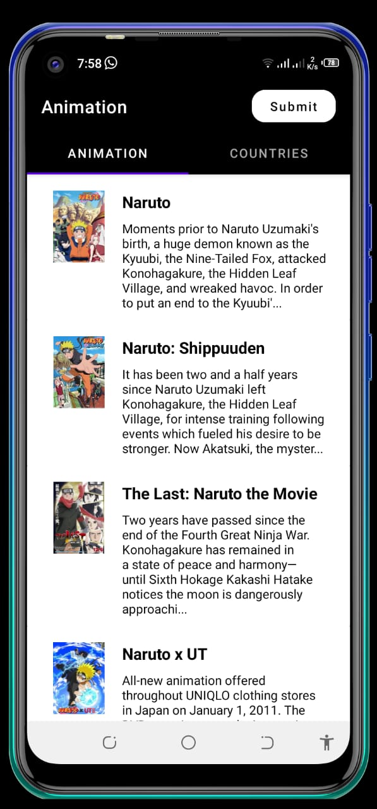
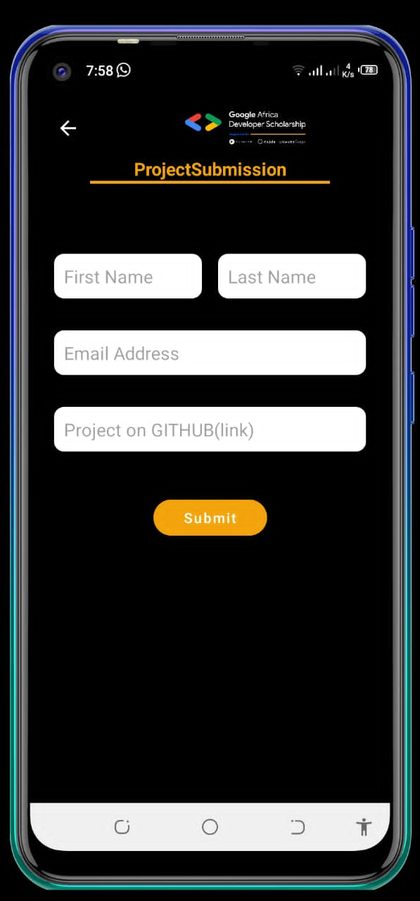
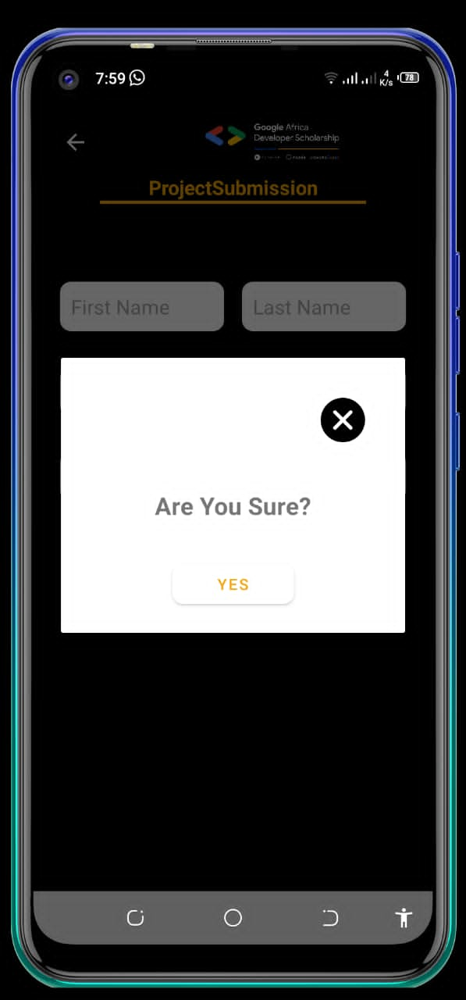
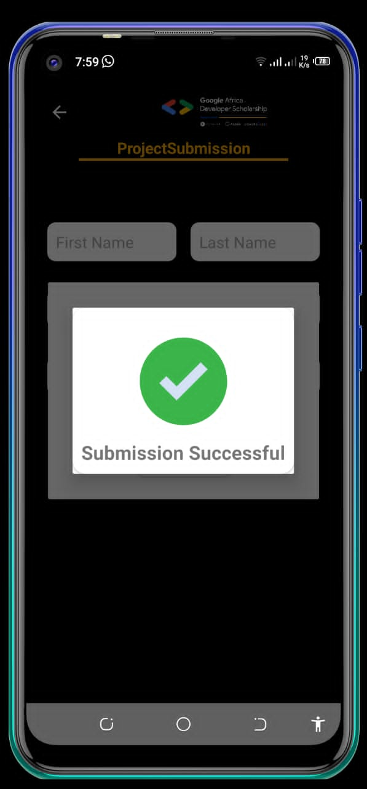
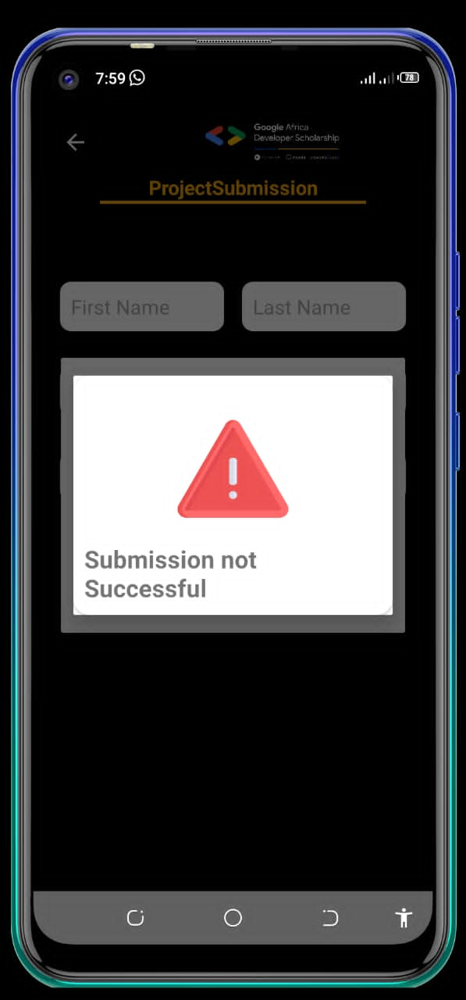

# Animation
This a basic app that make use of Tab layout recyclerview,retrofit,Glide and dialog strategies.The main aim was to learn about the basic concepts declared.

Min Api Level : 16

## Setup Requirements

- Android device or emulator
- Android Studio

## Getting Started

In order to get the app running yourself, you need to:

1.  clone this project
2.  Import the project into Android Studio
3.  Connect the android device with USB or just use your emulator
4.  In Android Studio, click on the "Run" button.

## Libraries

Libraries used in the whole application are:

- [Kotlin](https://developer.android.com/kotlin) - Kotlin is a programming language that can run on JVM. Google has announced Kotlin as one of its officially supported programming languages in Android Studio; and the Android community is migrating at a pace from Java to Kotlin
- [Retofit](https://square.github.io/retrofit) -  Retrofit is a REST Client for Java and Android by Square inc under Apache 2.0 license. Its a simple network library that used for network transactions. By using this library we can seamlessly capture JSON response from web service/web API.
- [gson](https://github.com/google/gson)
## Demo

  

## Support
- Found this project useful ❤️? Support by clicking the ⭐️ button on the upper right of this page. ✌️
- Notice anything else missing? File an issue
- Feel free to contribute in any way to the project from typos in docs to code review are all welcome.